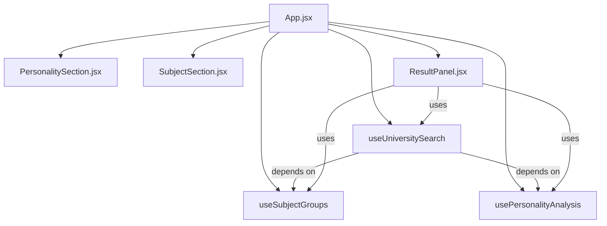

# Báo Cáo Đóng Góp — Thành Viên C
### Dự án: AI University Adviser

> **Thành viên:** Bùi Thị Huyền
> **Vai trò:** Frontend · React 19 + Vite · UI/UX · Custom Hooks · Tích hợp REST API

---

## Mục lục

1. [Phân tích hệ thống và phân chia công việc](#1-phân-tích-hệ-thống-và-phân-chia-công-việc)
   - 1.1 [Cách tiếp cận phân tích](#11-cách-tiếp-cận-phân-tích)
   - 1.2 [Kiến trúc tổng thể sau phân tích](#12-kiến-trúc-tổng-thể-sau-phân-tích)
   - 1.3 [Phân chia công việc giữa 3 thành viên](#13-phân-chia-công-việc-giữa-3-thành-viên)
   - 1.4 [Điểm giao nhau giữa Thành viên C với các thành viên khác](#14-điểm-giao-nhau-giữa-thành-viên-c-với-các-thành-viên-khác)
2. [Cấu trúc thư mục — phần của Thành viên C](#2-cấu-trúc-thư-mục--phần-của-thành-viên-c)
   - 2.1 [Sơ đồ vị trí các file phụ trách](#21-sơ-đồ-vị-trí-các-file-phụ-trách)
   - 2.2 [Mô tả chi tiết và giải pháp kỹ thuật từng file](#22-mô-tả-chi-tiết-và-giải-pháp-kỹ-thuật-từng-file)
3. [Cách viết code](#3-cách-viết-code)
   - 3.1 [Quy trình phát triển UI từ yêu cầu đến component hoàn chỉnh](#31-quy-trình-phát-triển-ui-từ-yêu-cầu-đến-component-hoàn-chỉnh)
   - 3.2 [Nguyên tắc Clean Code và Best Practices cho Frontend React](#32-nguyên-tắc-clean-code-và-best-practices-cho-frontend-react)
   - 3.3 [Quy tắc commit và quản lý phiên bản](#33-quy-tắc-commit-và-quản-lý-phiên-bản)
4. [Công cụ hỗ trợ phát triển](#4-công-cụ-hỗ-trợ-phát-triển)
   - 4.1 [Lập trình và Type Checking](#41-lập-trình-và-type-checking)
   - 4.2 [Thiết kế UI/UX và Design System](#42-thiết-kế-uiux-và-design-system)
   - 4.3 [Kiểm thử và Debug giao diện](#43-kiểm-thử-và-debug-giao-diện)
   - 4.4 [Chất lượng code và Linting](#44-chất-lượng-code-và-linting)
   - 4.5 [Phân tích, Thiết kế và Diagram](#45-phân-tích-thiết-kế-và-diagram)
   - 4.6 [AI trợ lý lập trình](#46-ai-trợ-lý-lập-trình)
   - 4.7 [Quản lý môi trường Node.js và Dependencies](#47-quản-lý-môi-trường-nodejs-và-dependencies)

---

## 1. Phân tích hệ thống và phân chia công việc

### 1.1 Cách tiếp cận phân tích

Để thiết kế giao diện người dùng phù hợp với luồng nghiệp vụ tư vấn tuyển sinh, các phương pháp sau đã được sử dụng:

| Phương pháp | Mục đích | Công cụ |
|---|---|---|
| **Đọc API Contract từ Thành viên B** | Xác định chính xác cấu trúc JSON request/response của từng endpoint trước khi thiết kế UI | Tài liệu kỹ thuật của TV-B, Postman |
| **Phân tích luồng người dùng (User Flow)** | Vẽ toàn bộ hành trình của học sinh: từ chia sẻ bản thân -> phân tích AI -> chọn môn/điểm -> tìm trường | draw.io, Mermaid |
| **Tham khảo giao diện hiện đại** | Học hỏi pattern thiết kế từ các sản phẩm SaaS và EdTech thực tế | Dribbble, Figma Community, shadcn/ui |
| **Đọc source code backend cùng nhóm** | Hiểu rõ trạng thái lỗi (`status: error`), loading state và giới hạn input để xử lý UX chính xác | VS Code, GitHub history |
| **AI hỗ trợ rà soát** | Tóm tắt cấu trúc component phức tạp, gợi ý micro-animation phù hợp | Gemini / ChatGPT kết hợp kiểm chứng thực tế |

---

### 1.2 Kiến trúc tổng thể sau phân tích

```
+--------------------------------------------------------------------------+
|                     NGƯỜI DÙNG (Học sinh THPT)                           |
|                Trình duyệt web — Giao diện "AI Career Navigator"         |
+--------------------------------------------------------------------------+
                                     |
         +---------------------------+---------------------------+
         |                                                       |
         v                                                       v
+--------------------+                               +--------------------+
|   Cột trái (5/12) |                               |   Cột phải (7/12) |
|   Input & Profile |                               |   Results Panel   |
|                    |                               |                    |
| [PersonalitySection]                              | [ResultPanel]      |
|  - Textarea nhap  |                               |  - AdmissionSummary|
|    van ban so thich|                               |    (khoi thi + diem)|
|  - Suggestion chips|                               |  - PersonalityResult|
|  - Nut phan tich AI|                               |    (tags + summary)|
|                    |                               |  - DetailedAnalysis|
| [SubjectSection]  |                               |    (Markdown render)|
|  - Mon bat buoc   |                               |  - Uni Finder      |
|  - Mon tu chon    |                               |    (chon vung + loc)|
|  - Nhap diem      |                               |  - UniversityCards |
+--------------------+                               +--------------------+
         |                                                       |
         +---------------------------+---------------------------+
                                     |
                                     | Custom Hooks (State Management)
                                     v
+--------------------------------------------------------------------------+
|                         src/hooks/                                       |
|                                                                          |
|  usePersonalityAnalysis.js  --  POST /api/analyze-personality            |
|  useSubjectGroups.js        --  POST /api/get-valid-groups               |
|                                 Logic tinh diem theo subject_ids (int)   |
|  useUniversitySearch.js     --  POST /api/find-universities              |
+--------------------------------------------------------------------------+
                                     |
                                     | fetch() REST API (JSON)
                                     v
+--------------------------------------------------------------------------+
|                       Flask Backend (Thanh vien A & B)                  |
+--------------------------------------------------------------------------+
```

---

### 1.3 Phân chia công việc giữa 3 thành viên

#### Thành viên A — Flask Core & Database & Data Routes
- Hạ tầng Flask: `app.py`, `config.py`, `extensions.py`.
- Cơ sở dữ liệu: `models.py`, `database/schema.sql`, `database/seed.sql`.
- Data Routes: `routes/groups.py` (khối thi hợp lệ), `routes/universities.py` (lọc trường theo điểm và khu vực).

#### Thành viên B — AI Pipeline & RAG
- AI Core: `services/ai_service.py` (Groq HyDE, vietnamese-bi-encoder, Gemini Advice).
- Cache: `services/cache_service.py` (Redis, SHA-256 key, graceful fallback).
- AI Route: `routes/analyze.py` (endpoint `POST /api/analyze-personality`, rate limiter, pgvector CTE).

#### Thành viên C (Tác giả báo cáo) — Frontend — Toàn bộ thư mục `frontend/`

| Nhóm | Nội dung cụ thể |
|---|---|
| **Cấu hình dự án** | `vite.config.js`, `package.json`, `eslint.config.js`, `.gitignore` |
| **Điểm khởi đầu** | `index.html`, `src/main.jsx` |
| **Design System** | `src/index.css` — Design tokens, utility classes, animations |
| **App Root** | `src/App.jsx` — Layout chính, lắp ghép hooks và components |
| **Components** | `PersonalitySection.jsx`, `SubjectSection.jsx`, `ResultPanel.jsx` |
| **Custom Hooks** | `usePersonalityAnalysis.js`, `useSubjectGroups.js`, `useUniversitySearch.js` |
| **Hằng số dùng chung** | `src/constants/index.js` — `SUBJECT_LIST`, `SUGGESTION_CHIPS` |
| **Assets tĩnh** | `src/assets/hero.png`, `favicon.svg`, banner preview |

---

### 1.4 Điểm giao nhau giữa Thành viên C với các thành viên khác

Frontend và Backend giao tiếp hoàn toàn qua 3 REST API. Các hợp đồng này được xác định trước:

#### 1. Giao tiếp với Thành viên B (AI Endpoint):

- **Request:** `POST /api/analyze-personality` — Body `{ "text": "..." }`
- **Response thành công (200):**
  ```json
  {
    "status": "success",
    "ui_tags": ["#Tư_duy_logic", "#Thích_công_nghệ"],
    "top_majors": [{ "major_name": "...", "similarity_score": 0.89, ... }],
    "ai_majors_list": ["Công nghệ thông tin", "..."],
    "advice": {
      "tags": ["#Tư_duy_logic"],
      "summary": "...",
      "detailed_analysis": "..."
    }
  }
  ```
- **Response lỗi:** `{ "status": "error", "message": "..." }`

#### 2. Giao tiếp với Thành viên A (Data Endpoints):

- **`POST /api/get-valid-groups`** — Body `{ "subject_ids": [1, 2, 4] }`:
  - Response: `{ "status": "success", "valid_groups": [{ "id", "code", "description", "subject_ids": [1,2,4] }] }`
  - **Điểm quan trọng:** Frontend tính điểm dựa vào `subject_ids` kiểu `int` từ API (không parse chuỗi `description`). Đây là fix bug từ phiên bản cũ.
- **`POST /api/find-universities`** — Body `{ "ai_majors", "region", "user_groups" }`:
  - Response: `{ "status": "success", "data": [...danh sách trường + điểm chuẩn...] }`

---

## 2. Cấu trúc thư mục — phần của Thành viên C

### 2.1 Sơ đồ vị trí các file phụ trách

```
ai_university_adviser/
|
+-- frontend/                    [C] Toàn bộ thư mục — Thành viên C
    |
    +-- index.html               [C] Entry point HTML, mount <div id="root">
    +-- package.json             [C] Dependencies: react 19, vite 8, tailwindcss v4, react-markdown
    +-- vite.config.js           [C] Plugin React + Tailwind, Dev proxy /api -> :5000, port 3000
    +-- eslint.config.js         [C] ESLint: react-hooks, react-refresh rules
    +-- .gitignore               [C] Loại trừ node_modules/, dist/, .DS_Store
    |
    +-- src/
        +-- main.jsx             [C] ReactDOM.createRoot, import index.css
        +-- App.jsx              [C] Layout trang: Header, Hero, Grid 12-cột, Footer
        |                            Khởi tạo và kết nối 3 custom hooks
        |
        +-- index.css            [C] Design system toàn cục:
        |                            - CSS @theme tokens (brand/accent colors)
        |                            - .glass, .glass-light (glassmorphism)
        |                            - .gradient-text (text gradient 3 màu)
        |                            - .btn-primary (với hover pseudo-element)
        |                            - .input-dark, .tag, .spinner
        |                            - Animation: fadeUp, pulse-soft
        |
        +-- components/
        |   +-- PersonalitySection.jsx  [C] Form nhập văn bản + suggestion chips + nút phân tích AI
        |   +-- SubjectSection.jsx      [C] Chọn môn thi (toggle chips) + ô nhập điểm từng môn
        |   +-- ResultPanel.jsx         [C] Hiển thị toàn bộ kết quả: khối thi, tính cách AI,
        |                                   phân tích chi tiết (Markdown), tìm trường ĐH
        |
        +-- hooks/
        |   +-- usePersonalityAnalysis.js  [C] State + fetch POST /api/analyze-personality
        |   +-- useSubjectGroups.js        [C] State môn thi, sync điểm, fetch /api/get-valid-groups
        |   +-- useUniversitySearch.js     [C] State kết quả trường, fetch /api/find-universities
        |
        +-- constants/
        |   +-- index.js         [C] SUBJECT_LIST (9 môn với ID int), SUGGESTION_CHIPS (18 gợi ý)
        |
        +-- assets/
            +-- hero.png         [C] Ảnh minh họa (sử dụng trong giao diện)
```

---

### 2.2 Mô tả chi tiết và giải pháp kỹ thuật từng file

#### File 1: `src/index.css` — Design System Toàn cục

File này xây dựng ngôn ngữ thiết kế thống nhất cho toàn bộ ứng dụng, sử dụng **Tailwind CSS v4** với khả năng định nghĩa custom design tokens thông qua `@theme`:

1. **Bảng màu thương hiệu (Design Tokens):**
   ```css
   @theme {
     --color-brand-500: #6366f1;   /* Indigo -- màu chủ đạo */
     --color-accent-500: #06b6d4;  /* Cyan -- màu nhấn */
   }
   ```

2. **Nền Mesh Gradient đa lớp (Background):**
   Thay vì nền đơn sắc, ứng dụng dùng 3 lớp `radial-gradient` chồng nhau tạo hiệu ứng không gian sâu:
   ```css
   #root {
     background:
       radial-gradient(ellipse 80% 60% at 10% 0%, rgba(99,102,241,0.18) 0%, transparent 60%),
       radial-gradient(ellipse 60% 50% at 90% 100%, rgba(6,182,212,0.14) 0%, transparent 60%),
       #0f0f1a;
   }
   ```

3. **Glassmorphism (`.glass` và `.glass-light`):**
   Hiệu ứng kính mờ hiện đại — kết hợp nền trong suốt, `backdrop-filter: blur()` và viền mỏng:
   ```css
   .glass {
     background: rgba(255,255,255,0.04);
     backdrop-filter: blur(16px);
     border: 1px solid rgba(255,255,255,0.08);
     border-radius: 1.25rem;
   }
   ```

4. **Gradient Text (`.gradient-text`):**
   Tiêu đề chính sử dụng dải màu 3 điểm Indigo -> Cyan -> Violet để tạo điểm nhấn thị giác.

5. **Micro-animations:**
   - `.fade-up`: Hiệu ứng xuất hiện từ dưới lên khi component render.
   - `.pulse-soft`: Nhịp đập nhẹ nhàng cho badge trạng thái.
   - `.spinner`: Vòng tròn loading của các thao tác bất đồng bộ.

---

#### File 2: `src/App.jsx` — App Root & Layout Orchestrator

File này là trung tâm kết nối toàn bộ ứng dụng:

1. **Khởi tạo 3 Custom Hooks:**
   ```jsx
   const subjectGroups = useSubjectGroups()
   const personality   = usePersonalityAnalysis()
   const uniSearch     = useUniversitySearch({
     aiResult:            personality.aiResult,
     validGroups:         subjectGroups.validGroups,
     calculateGroupScore: subjectGroups.calculateGroupScore,
   })
   ```
   Hook `uniSearch` phụ thuộc dữ liệu từ hai hook còn lại — sự phụ thuộc được truyền qua props thay vì Context để giữ luồng dữ liệu đơn giản, tường minh.

2. **Layout 12 cột responsive:**
   - Mobile (`< lg`): Hiển thị dạng stack một cột.
   - Desktop (`lg:`): Cột trái 5/12 (inputs), cột phải 7/12 (results) — kết quả AI cần không gian hiển thị nhiều hơn.

3. **Sticky Header với Backdrop Blur:**
   Header bám đầu trang, áp dụng `backdrop-blur-xl` để nền phía sau vẫn thấy mờ, tạo cảm giác lớp trong suốt thực sự.

---

#### File 3: `src/components/PersonalitySection.jsx` — Nhập liệu AI

Component xử lý bước đầu tiên của hành trình người dùng:

1. **Suggestion Chips:** 18 gợi ý chia làm 3 nhóm (Sở thích, Kỹ năng, Tính cách) được import từ `constants/index.js`. Khi click, text được **nối thêm** (append) vào textarea thay vì thay thế, tránh xóa mất nội dung người dùng đã nhập.

2. **Tip Box:** Hộp gợi ý hướng dẫn học sinh viết input giàu thông tin hơn (môn tự tin nhất, vai trò trong nhóm...) để AI phân tích chính xác hơn.

3. **Nút phân tích:** Disabled và hiển thị spinner khi `isLoadingAi === true`, ngăn người dùng gọi API nhiều lần trong khi đang chờ.

---

#### File 4: `src/components/SubjectSection.jsx` — Hồ Sơ Xét Tuyển

Component cho phép nhập thông tin điểm thi song song mà không chặn luồng phân tích AI:

1. **Toggle môn tự chọn:** Tối đa 2 môn tự chọn (giới hạn bởi quy định khối thi 3 môn). Khi vượt quá 2 môn, hiển thị thông báo cảnh báo.

2. **Hiển thị môn bắt buộc:** Toán và Ngữ Văn luôn hiển thị dạng badge khóa (`cursor-not-allowed`), không thể bỏ chọn.

3. **Ô nhập điểm động:** Danh sách ô nhập điểm được sinh ra dựa theo `activeSubjects` (môn bắt buộc + môn đã chọn). Khi thêm/bỏ môn, ô điểm tự động được thêm/xóa, điểm đã nhập không bị mất.

---

#### File 5: `src/components/ResultPanel.jsx` — Bảng Kết Quả Tổng Hợp

Component phức tạp nhất, hiển thị 4 phân hệ theo thứ tự từ trên xuống:

1. **AdmissionSummary** — Hiển thị các khối thi hợp lệ và tổng điểm tính được:
   - Với mỗi khối thi, gọi hàm `calculateGroupScore(group)` để tính tổng điểm dựa trên `subject_ids` kiểu số nguyên nhận từ API (không dùng chuỗi).
   - Badge điểm đổi màu theo ngưỡng: xanh (đủ điểm hợp lệ), đỏ (thiếu môn).

2. **PersonalityResult** — Hiển thị kết quả phân tích tính cách AI:
   - `ui_tags`: Dải hashtag tính cách có màu gradient (indigo -> cyan -> violet) xen kẽ.
   - `summary`: Đoạn tóm tắt ngắn hiển thị thẳng.
   - Nút "Xem phân tích chi tiết" toggle `showDetailedAnalysis`.

3. **DetailedAnalysis** — Render Markdown từ `detailed_analysis` của Gemini:
   - Sử dụng `react-markdown` + `remark-gfm` để biến chuỗi Markdown thành React elements.
   - `MD_COMPONENTS` là object ánh xạ từng HTML tag (`p`, `strong`, `ul`, `li`, `h1`, `h2`, `h3`...) sang component có style dark-theme tùy chỉnh, đảm bảo kết quả AI luôn hiển thị đẹp trong giao diện tối.

4. **UniversityFinder** — Tìm trường theo khu vực:
   - 4 nút lọc khu vực: `ALL | Bắc | Trung | Nam`.
   - Khi click, gọi `handleFindUniversities(region)` với danh sách ngành AI gợi ý và điểm thi đã nhập.
   - Kết quả hiển thị dạng card accordion — click vào tên ngành để mở rộng xem điểm chuẩn qua các năm.

---

#### File 6: `src/hooks/useSubjectGroups.js` — Quản lý Môn Thi & Điểm

Custom hook này đặc biệt quan trọng vì xử lý sự phức tạp của đồng bộ trạng thái:

1. **`useEffect` đồng bộ điểm khi thêm/bỏ môn:**
   ```js
   useEffect(() => {
     const ids = [1, 2, ...optionalSubjects]
     setSubjectScores(prev => {
       const next = { ...prev }
       ids.forEach(id => { if (next[id] === undefined) next[id] = '' })
       Object.keys(next).forEach(id => {
         if (!ids.includes(parseInt(id))) delete next[id]
       })
       return next
     })
     if (optionalSubjects.length >= 1) fetchValidGroups(ids)
   }, [optionalSubjects])
   ```
   Pattern này đảm bảo điểm đã nhập không bị mất khi người dùng thêm môn mới.

2. **`calculateGroupScore(group)`:**
   Tính điểm tổng theo `group.subject_ids` (mảng số nguyên), không phụ thuộc vào chuỗi `description`. Đây là bug fix so với phiên bản cũ.

---

#### File 7: `src/constants/index.js` — Hằng số Dùng Chung

Tập trung các dữ liệu tĩnh sử dụng nhiều nơi:
- `SUBJECT_LIST`: 9 môn học với `id` kiểu số nguyên (quan trọng — phải khớp với ID trong PostgreSQL do Thành viên A định nghĩa).
- `SUGGESTION_CHIPS`: 18 gợi ý chia 3 nhóm, mỗi nhóm có màu riêng (indigo, emerald, violet).

---

## 3. Cách viết code

### 3.1 Quy trình phát triển UI từ yêu cầu đến component hoàn chỉnh

```
[1. Đọc API Contract]   ---> Xác định cấu trúc dữ liệu request/response
           |                  từ Thành viên A và B trước khi code
           v
[2. Phác thảo Layout]   ---> Vẽ wireframe thô (draw.io) hoặc sketch trên giấy
           |                  Xác định layout responsive (mobile/desktop)
           v
[3. Thiết kế Hook]      ---> Xác định state cần quản lý, hàm xử lý sự kiện,
           |                  API call bất đồng bộ trong custom hook
           v
[4. Xây dựng Component] ---> Code JSX nhận state qua props,
           |                  áp dụng design system từ index.css
           v
[5. Kiểm thử UX]        ---> Chạy dev server, test thực tế trên trình duyệt:
           |                  - Loading state có hiển thị không?
           |                  - Error có thông báo rõ ràng không?
           |                  - Responsive trên mobile có bị vỡ không?
           v
[6. Kiểm thử tích hợp]  ---> Đảm bảo fetch API trả về đúng cấu trúc,
                              JSON parse không bị crash khi backend trả lỗi
```

**Ví dụ thực tế với `ResultPanel.jsx`:**
- Gemini trả về `detailed_analysis` chứa Markdown (`**in đậm**`, danh sách...).
- Nếu render trực tiếp thành text, giao diện hiển thị ký tự `**` thô.
- Giải pháp: Tích hợp `react-markdown` + `remark-gfm` với `MD_COMPONENTS` tùy chỉnh để giữ nguyên dark-theme.

---

### 3.2 Nguyên tắc Clean Code và Best Practices cho Frontend React

#### Nguyên tắc 1 — Tách biệt Logic (Hooks) và Giao diện (Components)
Không viết `fetch()` hay `useState` phức tạp trực tiếp trong JSX component. Mọi logic nghiệp vụ được đưa vào custom hook:
```js
// ĐÚNG: Component chỉ nhận props và render UI
export default function SubjectSection({ optionalSubjects, toggleSubject, ... }) {
  return <div>...</div>
}

// ĐÚNG: Hook quản lý state, side effects và API calls
export function useSubjectGroups() {
  const [optionalSubjects, setOptionalSubjects] = useState([])
  // ...logic...
  return { optionalSubjects, toggleSubject, subjectScores, ... }
}
```

#### Nguyên tắc 2 — Props rõ ràng, không truyền object khổng lồ
Không truyền toàn bộ `state` hay object vào component con. Chỉ destructure đúng phần cần thiết:
```jsx
// SAI: Truyền toàn bộ hook object -- không rõ component dùng gì
<SubjectSection groups={subjectGroups} />

// ĐÚNG: Chỉ truyền đúng props cần thiết
<SubjectSection
  optionalSubjects={subjectGroups.optionalSubjects}
  toggleSubject={subjectGroups.toggleSubject}
  subjectScores={subjectGroups.subjectScores}
  handleScoreChange={subjectGroups.handleScoreChange}
  subjectNotice={subjectGroups.subjectNotice}
/>
```

#### Nguyên tắc 3 — Xử lý đầy đủ các trạng thái UI (Loading / Error / Empty / Success)
Mỗi tính năng bất đồng bộ phải xử lý đủ 4 trạng thái:
```jsx
{isLoadingAi && <div className="spinner mx-auto" />}
{aiError && <p className="text-red-400">{aiError}</p>}
{!aiResult && !aiError && !isLoadingAi && <p className="text-slate-600 italic">Chưa có kết quả...</p>}
{aiResult && <PersonalityResult result={aiResult} />}
```

#### Nguyên tắc 4 — Hằng số tập trung, không hardcode trong JSX
Dữ liệu tĩnh (danh sách môn, gợi ý) luôn nằm trong `constants/index.js` để tránh lặp code và dễ cập nhật:
```js
// SAI: Hardcode trực tiếp trong component
const subjects = [{ id: 1, name: 'Toan' }, ...]

// ĐÚNG: Import từ constants
import { SUBJECT_LIST } from '../constants'
```

#### Hướng dẫn cụ thể theo từng file:

| File | Nguyên tắc ưu tiên hàng đầu |
|---|---|
| `index.css` | Ưu tiên utility class tái sử dụng (`.glass`, `.btn-primary`) thay vì inline style; không lặp CSS |
| `App.jsx` | Chỉ chứa layout và kết nối hooks — không viết logic nghiệp vụ tại đây |
| `components/*.jsx` | Nhận dữ liệu qua props, không tự fetch API; tách sub-component nhỏ khi component > 150 dòng |
| `hooks/*.js` | Mỗi hook phụ trách đúng 1 domain; export đủ state và handler để component không cần biết cách hoạt động bên trong |
| `constants/index.js` | Giữ `SUBJECT_LIST.id` luôn đồng bộ với ID môn học trong PostgreSQL (do Thành viên A định nghĩa) |

---

### 3.3 Quy tắc commit và quản lý phiên bản

Áp dụng quy chuẩn **Conventional Commits** với phạm vi cụ thể cho Frontend:

```bash
# Format: <type>(<scope>): <mô tả ngắn>
feat(ui): add suggestion chips with append behavior in PersonalitySection
feat(hooks): implement useSubjectGroups with subject_ids-based score calculation
fix(result): render Markdown with custom dark-theme MD_COMPONENTS
fix(hooks): sync subject scores on optional subject toggle without losing existing scores
style(css): add glassmorphism .glass and .glass-light utility classes
refactor(app): move inline fetch logic to useUniversitySearch hook
chore(deps): add react-markdown remark-gfm for safe Markdown rendering
```

---

## 4. Công cụ hỗ trợ phát triển

### 4.1 Lập trình và Type Checking

| Công cụ | Vai trò | Lý do lựa chọn |
|---|---|---|
| **VS Code** | IDE chính | Extension ES7+ React Snippets, auto-import, tích hợp Git và terminal |
| **ESLint** (plugin react-hooks) | Kiểm tra quy tắc Hooks | Cảnh báo khi quên dependencies trong `useEffect`, tránh bug state cũ |
| **Prettier** | Định dạng code JSX tự động | Giữ chuẩn style nhất quán: dấu nháy, indent, trailing comma |

```bash
# Chạy lint và format trước khi commit
npm run lint
npx prettier --write src/
```

---

### 4.2 Thiết kế UI/UX và Design System

| Công cụ | Vai trò | Lý do lựa chọn |
|---|---|---|
| **Tailwind CSS v4** | Utility-first CSS framework | Config qua `@theme` trong CSS, không cần `tailwind.config.js` riêng |
| **Figma / Excalidraw** | Phác thảo wireframe và user flow | Nhanh, chia sẻ được với nhóm mà không cần cài phần mềm |
| **Dribbble / shadcn/ui** | Tham khảo pattern thiết kế hiện đại | Học hỏi pattern glassmorphism, gradient text, dark dashboard từ cộng đồng |

---

### 4.3 Kiểm thử và Debug giao diện

| Công cụ | Vai trò | Lý do lựa chọn |
|---|---|---|
| **Chrome DevTools** | Inspect element, debug state, mô phỏng mobile | Xem kết quả render, kiểm tra network request/response JSON |
| **React DevTools Extension** | Xem cây component và state của hooks | Debug giá trị state của `useSubjectGroups`, `usePersonalityAnalysis` theo thời gian thực |
| **Vite Dev Server** | Hot Module Replacement (HMR) | Lưu file -> giao diện cập nhật tức thì, không cần reload trang, giữ nguyên state |

```bash
# Khởi động dev server với hot reload
npm run dev
# Mặc định: http://localhost:3000
# Proxy /api/* -> http://127.0.0.1:5000 (cấu hình trong vite.config.js)
```

---

### 4.4 Chất lượng code và Linting

| Công cụ | Vai trò | Lý do lựa chọn |
|---|---|---|
| **ESLint** (`eslint-plugin-react-hooks`) | Kiểm tra quy tắc Hooks (deps array) | Bắt lỗi "stale closure" phổ biến trong `useEffect` |
| **eslint-plugin-react-refresh** | Đảm bảo HMR hoạt động đúng | Cảnh báo khi export default không phải React component |

---

### 4.5 Phân tích, Thiết kế và Diagram

| Công cụ | Vai trò | Lý do lựa chọn |
|---|---|---|
| **draw.io** | Vẽ user flow và sơ đồ component | Miễn phí, export PNG/SVG, dùng online |
| **Mermaid** | Diagram dạng text trong Markdown | Nhúng trực tiếp vào tài liệu kỹ thuật |
| **GitHub** | Quản lý mã nguồn, review code | `git blame` để hiểu lịch sử phát triển từng component |



---

### 4.6 AI trợ lý lập trình

| Công cụ | Vai trò trong quá trình làm việc | Lưu ý quan trọng |
|---|---|---|
| **Antigravity (AI IDE)** | Hiểu context toàn dự án, refactor hooks và component, viết tài liệu kỹ thuật | Gợi ý chính xác vì hiểu cả codebase backend và frontend |
| **GitHub Copilot** | Autocomplete JSX boilerplate, gợi ý className Tailwind | Luôn kiểm tra logic render điều kiện và dependency array |
| **Gemini / ChatGPT** | Giải thích hành vi của thư viện mới (react-markdown, remark-gfm), debug CSS animation | Không paste API key hay nội dung nhạy cảm vào chat |

> **Nguyên tắc cốt lõi:** AI không thay thế được việc hiểu UX. Quyết định hiển thị gì, khi nào, với animation như thế nào phải xuất phát từ góc nhìn người dùng thực sự — không phải từ gợi ý AI.

---

### 4.7 Quản lý môi trường Node.js và Dependencies

```bash
# Đảm bảo Node.js >= 18 (yêu cầu của Vite 8 và React 19)
node -v

# Vào thư mục frontend và cài đặt dependencies
cd frontend
npm install

# Khởi động môi trường phát triển (Hot Reload)
npm run dev

# Build production bundle (chỉ khi cần deploy)
npm run build

# Kiểm tra build output
ls -lh dist/assets/

# Thêm package mới -- cập nhật package.json ngay
npm install <package-name>
# Đừng quên commit package.json và package-lock.json cùng nhau
```

**Thư viện quan trọng và lý do chọn:**

| Package | Phiên bản | Lý do |
|---|---|---|
| `react` | ^19.2.4 | Concurrent features, cải thiện performance rendering |
| `vite` | ^8.0.1 | Dev server cực nhanh nhờ ESM native, HMR tức thì |
| `tailwindcss` | ^4.2.2 | v4 dùng `@theme` trong CSS, không cần config JS phức tạp |
| `react-markdown` | ^10.1.0 | Render output Markdown từ Gemini thành React elements an toàn |
| `remark-gfm` | ^4.0.1 | Hỗ trợ bảng, danh sách đánh dấu, strikethrough trong Markdown |
| `framer-motion` | ^12.38.0 | Animation mượt mà cho các component transition |
| `lucide-react` | ^1.7.0 | Bộ icon SVG nhất quán, tree-shakeable (chỉ bundle icon dùng) |

---

*Thành viên C — AI University Adviser 2026*
